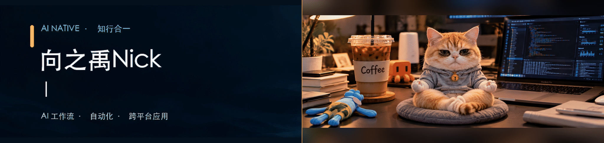

  

---

## 你好，我是向之禹Nick

我喜欢从真实问题出发，把繁琐的步骤整理成清楚、可靠、能持续迭代的软件。

目前关注 **AI 工作流、自动化和跨平台应用**，也在探索怎样让日常创作与开发更轻松。

## 关注的方向

<table>
  <tr>
    <td>
      <strong>AI 与自动化</strong> 
      把重复流程变成清晰、可复用的工具。
    </td>
    <td>
      <strong>跨平台应用</strong> 
      围绕真实场景，打磨轻量、顺手的体验。
    </td>
    <td>
      <strong>创作工具</strong> 
      让内容整理、语音与视频处理少一些重复劳动。
    </td>
  </tr>
</table>

## 做事方式

从真实问题开始，小步构建，验证效果，再持续改进。

  Build with intent · Ship in small steps

